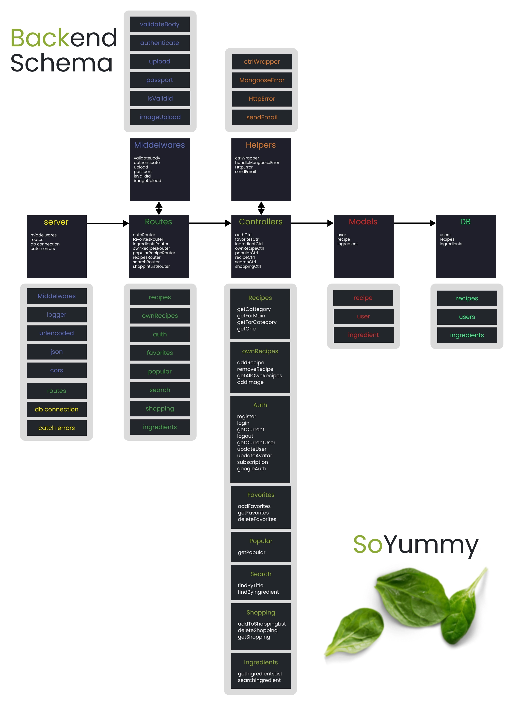

## SoYummy

### GoIT Node.js Team Project

Бекенд частина фінального командного проекту на курсі FullStack

- Додаток написаний на NodeJS
- Сервер написано на express
- Збереження даних з домопогою mongoose
- Дані зберігаються в MongoDB
- Зображення зберігаються на Cloudinary
- Реалізована реєстрація з допомогою Google
- Паролі хешуються

### Посилання

- [Live Page ](https://github.com/romaniv2511/so-yummy)
- [FrontEnd ](https://github.com/romaniv2511/so-yummy)

### Запуск

- `npm start` &mdash; старт сервера в режимі production
- `npm run dev` &mdash; старт сервера в режимі розробки (development)

### Розробники

- [Oleksandr Sorokolit](https://github.com/Alex-Sorokolit)
- [Yevhenii Zinych](https://github.com/YevheniiZinych)
- [Viacheslav Miakota](https://github.com/ViacheslavMiakota)
